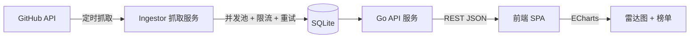

# TrendScope 设计文档

日期: 2026-08-12

## 1. 项目目标

一个展示 GitHub 技术趋势的 Web 应用。定时从 GitHub API 抓取仓库与语言数据,存储到 SQLite,通过 Web 界面以雷达图与榜单形式呈现技术热点,支持日 / 周 / 月时间窗口切换。

定位: 面试作品集,重点展示 **后端能力 (Go)**、**全栈能力 (前后端分离)**、**工程化能力 (并发抓取 / Docker / CI / 测试)**。

## 2. 技术决策

| 方面 | 决定 | 理由 |
|---|---|---|
| 后端语言 | Go 1.24 | 环境已装;goroutine 并发抓取 GitHub API 优势明显 |
| 前端 | 独立轻量前端 (原生 JS + ECharts) | 前后端分离,API 边界清晰,工程结构好讲 |
| 存储 | SQLite | 零依赖,单二进制 + 单文件部署 |
| 数据源 | GitHub Search API | 免费、数据真实丰富 |
| 部署 | Docker Compose | 一键启动,展示工程化 |
| 维度 | 语言趋势雷达 + 热门仓库榜 + 日/周/月切换 | 经典技术雷达结构 |

## 3. 架构总览

三个独立模块:

- **Ingestor**: 定时任务,并发抓取 GitHub 数据写入 SQLite
- **API 服务**: 提供 REST 接口,读 SQLite 返回 JSON
- **前端 SPA**: 静态页面,调 API 渲染雷达图与榜单

## 4. 组件设计

### 4.1 Ingestor (抓取器)

- goroutine 并发池 (5 个 worker) 拉取热门仓库
- 限流: 读取 `X-RateLimit-*` 响应头自适应,预留余量
- 重试: 指数退避,5xx / 限流时延迟重试
- 快照式存储: 每次抓取生成带时间戳的快照,便于计算趋势
- 定时调度: 默认每小时抓取一次,可用配置调整

### 4.2 API 服务

- `GET /api/repos?window=day|week|month` — 热门仓库榜
- `GET /api/radar?window=day|week|month` — 语言雷达数据 (各语言活跃度分数)
- `GET /api/languages` — 支持的语言列表
- `GET /healthz` — 健康检查
- 统一 JSON 响应格式,含错误处理

### 4.3 SQLite 表

- `repos` — 仓库快照: id, full_name, owner, stars, language, description, html_url, snapshot_time
- `snapshots` — 快照索引: id, created_at
- 索引: repos (snapshot_time), repos (language)

### 4.4 前端

- 单页应用,顶部时间窗口 Tab (日 / 周 / 月)
- 雷达图 (ECharts): 各语言活跃度分数
- 热门仓库列表: 星标增速、语言标签、跳转链接
- 由 Go 服务托管静态文件 (embed),也可 Nginx 托管

## 5. 工程化

- Dockerfile (后端多阶段构建), docker-compose 编排后端 + 前端 (或合并为单个后端容器托管静态文件)
- CI (GitHub Actions): `go vet` + `go test` + 前端构建
- 单元测试: 抓取解析、API handler、趋势计算
- README: 架构图、快速开始、API 文档

## 6. 里程碑

1. **M1 骨架**: 初始化 Go 工程 + SQLite 存储层 + 基本 API
2. **M2 抓取**: GitHub 抓取器 + 并发池 + 定时任务 + 快照存储
3. **M3 前端**: 雷达图 + 榜单 + 时间切换
4. **M4 工程化**: Docker + CI + 测试 + README

## 7. 范围外 (YAGNI)

- 用户系统 / 登录鉴权
- 多数据源聚合 (HackerNews 等)
- 分布式部署 / 多实例
- 持久化数据库迁移系统
